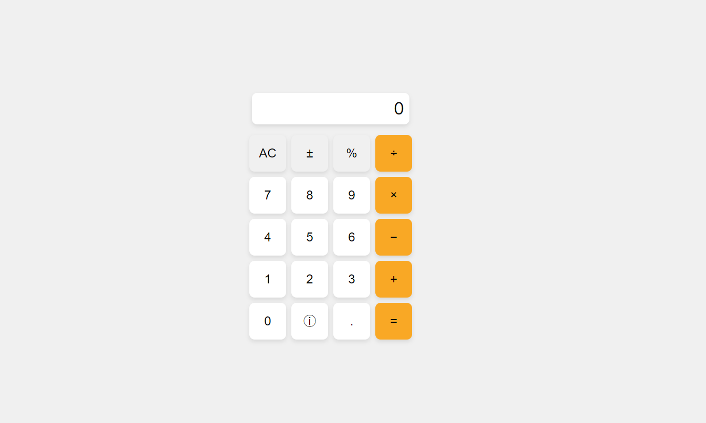

# My Calculator Project

This is a modern, minimal UI calculator built with Next.js. It features a clean design and includes basic arithmetic operations.

## Features
- Addition, Subtraction, Multiplication, Division
- Percentage Calculation
- Clear Display

## Usage
1. Clone the repository
2. Install dependencies
3. Run the development server

## License
This project is licensed under the MIT License.
